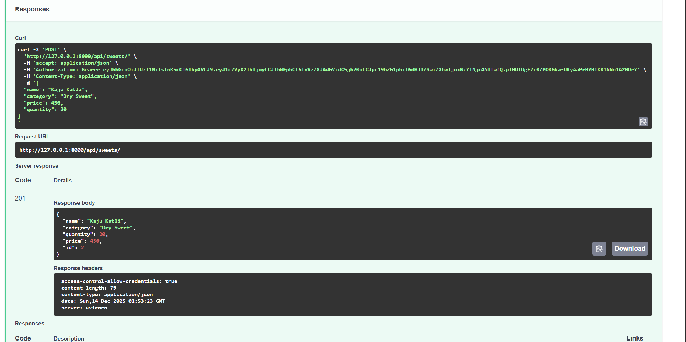
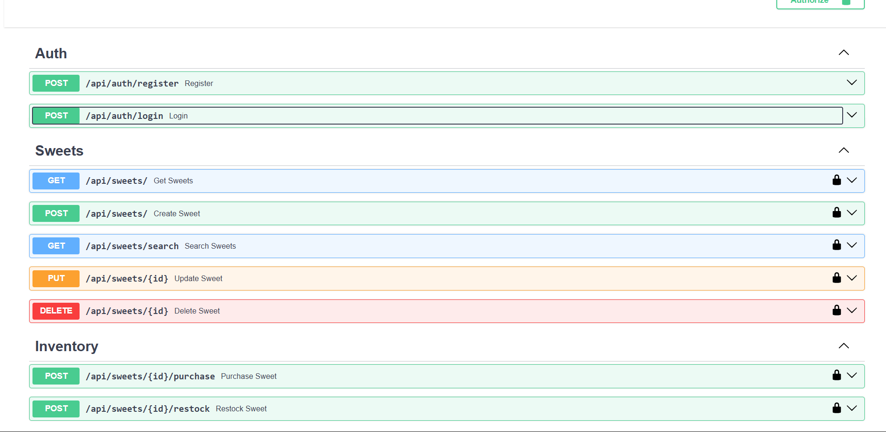
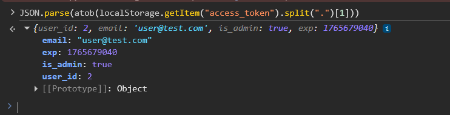
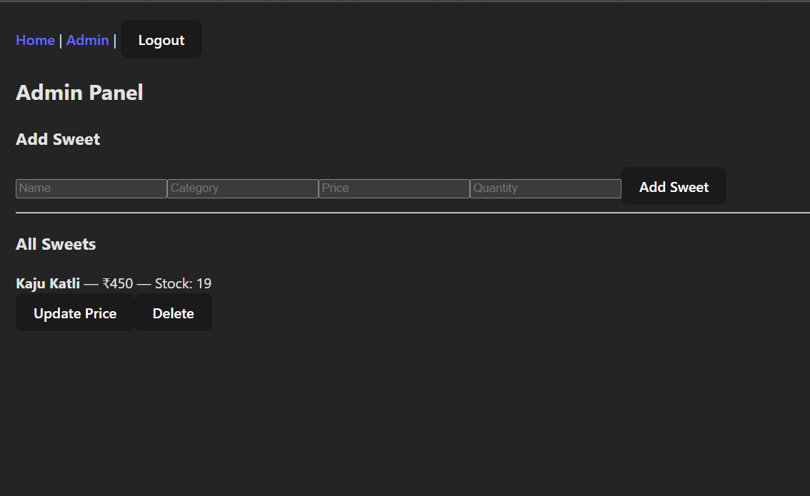
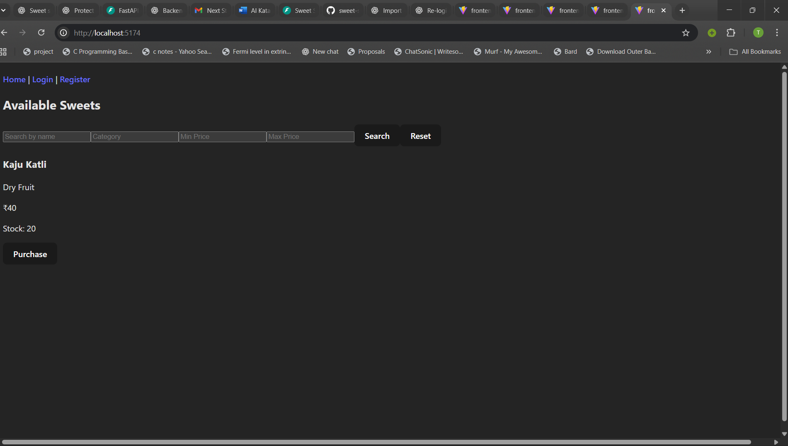
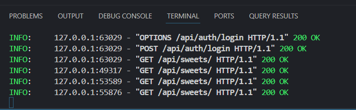
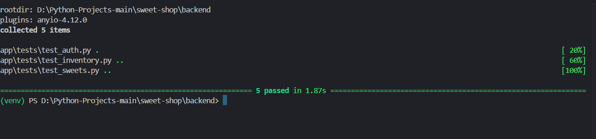

# 🍬 Sweet Shop Management System

A full-stack **Sweet Shop Management System** built using **FastAPI (backend)** and **React + Vite (frontend)**.  
The application supports **JWT-based authentication**, **role-based authorization (Admin/User)**, inventory management, and a clean admin dashboard.

---

## 🚀 Features

### 🔐 Authentication & Authorization
- User registration and login
- JWT-based authentication
- Role-based access control (Admin vs User)
- Protected API routes

### 🍭 Sweet Management (Admin Only)
- Add new sweets
- Update sweet price and quantity
- Delete sweets
- Restock inventory

### 🛒 User Features
- View available sweets
- Purchase sweets (stock decreases automatically)

### 🧪 Testing
- Backend APIs tested using pytest
- Auth, sweets, and inventory flows validated

---

## 🛠 Tech Stack

### Backend
- FastAPI
- SQLAlchemy
- SQLite
- JWT (python-jose)
- Passlib (bcrypt)
- Pytest

### Frontend
- React (Vite)
- JavaScript
- Fetch API
- JWT stored in localStorage

---

## 📂 Project Structure

```
sweet-shop/
│
├── backend/
│   ├── app/
│   │   ├── routers/
│   │   ├── models.py
│   │   ├── main.py
│   │   └── deps.py
│   └── tests/
│
├── frontend/
│   ├── src/
│   ├── index.html
│   └── package.json
│
└── README.md
```

---

## ▶️ How to Run Backend (Locally)

```bash
cd backend
python -m venv venv
venv\Scripts\activate
pip install -r requirements.txt
uvicorn app.main:app --reload
```

Backend runs at:
```
http://127.0.0.1:8000
```

Swagger UI:
```
http://127.0.0.1:8000/docs
```

---

## ▶️ How to Run Frontend (Locally)

```bash
cd frontend
npm install
npm run dev
```

Frontend runs at:
```
http://localhost:5173
```

---

## 🔐 JWT Verification (Manual Check)

After login, the JWT token is stored in browser localStorage.

Open Browser DevTools → Console and run:

```js
JSON.parse(atob(localStorage.getItem("access_token").split(".")[1]))
```

Example decoded payload:

```json
{
  "user_id": 2,
  "email": "user@test.com",
  "is_admin": true,
  "exp": 1765678483
}
```

---
## 🧪 Test-Driven Development (TDD)

The backend of this application was developed using a test-first mindset for core business logic such as authentication, sweets management, and inventory workflows.

For critical features, tests were written early to define expected behavior, validate edge cases, and enforce authorization rules. These tests guided the implementation and helped ensure correctness and stability.

While not every feature strictly follows a visible red–green–refactor commit sequence, the presence of meaningful test coverage reflects the principles of Test-Driven Development and supports safe refactoring and regression prevention.


---
## 🧪 Running Tests

```bash
cd backend
pytest
```

---

## 📸 Screenshots

### 🔐 Swagger UI – Protected Endpoint (Admin)


### 📘 Swagger API Overview


### 🔑 JWT Token Decoded in Browser Console


### 🛠 Admin Dashboard (Add / Update / Delete Sweet)


### 🍬 Sweet List (Frontend User View)


### 🧾 Backend Logs (API Activity)


### 🧪 Test Report (Pytest Results)



## 🤖 AI Usage Disclosure

ChatGPT was used during development to:
- Design JWT authentication and role-based authorization
- Structure FastAPI routers and dependencies
- Debug authentication and frontend-backend integration
- Assist in writing documentation and README

Note: AI assistance was primarily used during early backend scaffolding and architectural decisions. Subsequent documentation and UI changes were done manually.

All code was manually reviewed, tested, and validated by the developer.

---

## ✅ Project Status

- Authentication: ✅ Complete  
- Authorization: ✅ Complete  
- Admin Panel: ✅ Complete  
- Frontend Integration: ✅ Complete  
- Tests: ✅ Complete  
 
---

## 👤 Author

**Tekrat**
